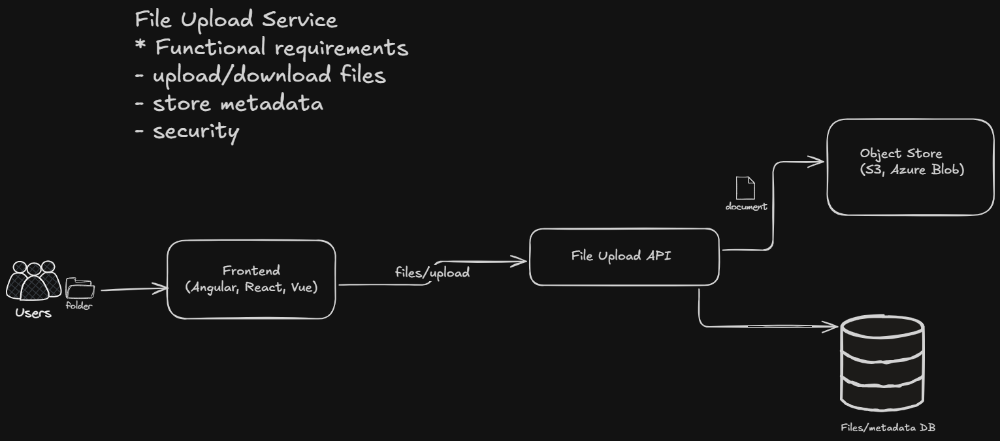

# FileUploader

A simple learning project - upload and download files using .NET API, Angular frontend, and Azure Blob Storage.

## What It Does

- Upload files through a web interface
- Files get stored in Azure Blob Storage
- Download files back from the cloud
- View a list of all uploaded files

## Architecture



## Stack

- **Backend**: ASP.NET Core Web API (.NET 10)
- **Frontend**: Angular
- **Storage**: Azure Blob Storage (fileuploaddemo123/sample)
- **Database**: SQLite (stores file metadata)

## Quick Start

### Backend
```bash
cd FileUploader.Api
dotnet run
```
API runs at http://localhost:5000 • Swagger at /swagger

### Frontend
```bash
cd FileUploader.UI
npm install
npm start
```
App runs at http://localhost:4200

## Setup

1. **Azure CLI Login**
   ```powershell
   az login
   ```

2. **Configure ppsettings.json**
   ```json
   {
     "BlobStorage": {
       "AccountUrl": "https://fileuploaddemo123.blob.core.windows.net",
       "ContainerName": "sample"
     },
     "ConnectionStrings": {
       "Database": "Data Source=fileuploader.db"
     }
   }
   ```

3. **Run it!**

## API Endpoints

- POST /files/upload - Upload a file
- GET /files - List all files
- GET /files/{id}/download - Download a file

## Learning Goals

This project demonstrates:
- Building a REST API with ASP.NET Core
- Connecting to Azure Blob Storage
- Entity Framework Core and SQLite
- Angular frontend consuming a .NET API
- CORS setup between frontend/backend
